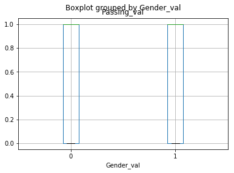
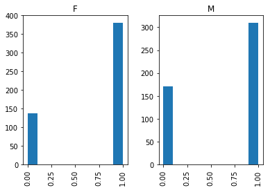

# Algebradata
Assignment 1

Download and view https://github.com/willmattsue/Algebradata/blob/master/Algebradata%2BAssignment.html 


```python
# The Algebra data set is a csv file, comprised of 999 student grades. 
# The file shows for each student: First and Last Names,Gender, Grade and Hours of Study.
# Python for Data-Analytics is used to perform simple analysis of the dataset.
```


```python
# Import Libraries
import pandas as pd
import numpy as np
from numpy import random
import matplotlib.pyplot as plt
import sys

# Enable inline plotting
%matplotlib inline
```


```python
# Location of file
Location = "C:\\Users\\Matthew\\Desktop\\datasets\\algebradata.csv"
```


```python
# Loading data from csv file
df = pd.read_csv(Location)
```


```python
# Create a column 'is Failing' to deduce students with passing grades
df['is Failing'] = np.where(df['Grade']>'C', 'yes', 'no')
```


```python
df.tail()
```


<div>
<style>
    .dataframe thead tr:only-child th {
        text-align: right;
    }

    .dataframe thead th {
        text-align: left;
    }

    .dataframe tbody tr th {
        vertical-align: top;
    }
</style>
<table border="1" class="dataframe">
  <thead>
    <tr style="text-align: right;">
      <th></th>
      <th>Fname</th>
      <th>Lname</th>
      <th>Gender</th>
      <th>Grade</th>
      <th>Hours of Study</th>
      <th>is Failing</th>
    </tr>
  </thead>
  <tbody>
    <tr>
      <th>994</th>
      <td>Harold</td>
      <td>Looner</td>
      <td>M</td>
      <td>D</td>
      <td>11</td>
      <td>yes</td>
    </tr>
    <tr>
      <th>995</th>
      <td>Paula</td>
      <td>Moore</td>
      <td>F</td>
      <td>C</td>
      <td>6</td>
      <td>no</td>
    </tr>
    <tr>
      <th>996</th>
      <td>Martin</td>
      <td>Franklin</td>
      <td>M</td>
      <td>C</td>
      <td>25</td>
      <td>no</td>
    </tr>
    <tr>
      <th>997</th>
      <td>Nicole</td>
      <td>Henderson</td>
      <td>F</td>
      <td>A</td>
      <td>20</td>
      <td>no</td>
    </tr>
    <tr>
      <th>998</th>
      <td>Veronica</td>
      <td>Harrison</td>
      <td>F</td>
      <td>D</td>
      <td>21</td>
      <td>yes</td>
    </tr>
  </tbody>
</table>
</div>


```python
# The response "no" to 'is failing' = number of students with passing grades(A,B or C)
# The total number of students passing is 691/999
# % of students passing = 691/999 * 100 = 
df.loc[df['is Failing']=='no'].count()
```


    Fname             691
    Lname             691
    Gender            691
    Grade             691
    Hours of Study    691
    is Failing        691
    dtype: int64


```python
def score_to_numeric(x):
    if x=='F':
        return 1
    if x=='M':
        return 0
```


```python
# Applying a numeric score to Gender for easier analysis:
df['Gender_val'] = df['Gender'].apply(score_to_numeric)
```


```python
df.tail()
```


<div>
<style>
    .dataframe thead tr:only-child th {
        text-align: right;
    }

    .dataframe thead th {
        text-align: left;
    }

    .dataframe tbody tr th {
        vertical-align: top;
    }
</style>
<table border="1" class="dataframe">
  <thead>
    <tr style="text-align: right;">
      <th></th>
      <th>Fname</th>
      <th>Lname</th>
      <th>Gender</th>
      <th>Grade</th>
      <th>Hours of Study</th>
      <th>is Failing</th>
      <th>Gender_val</th>
    </tr>
  </thead>
  <tbody>
    <tr>
      <th>994</th>
      <td>Harold</td>
      <td>Looner</td>
      <td>M</td>
      <td>D</td>
      <td>11</td>
      <td>yes</td>
      <td>0</td>
    </tr>
    <tr>
      <th>995</th>
      <td>Paula</td>
      <td>Moore</td>
      <td>F</td>
      <td>C</td>
      <td>6</td>
      <td>no</td>
      <td>1</td>
    </tr>
    <tr>
      <th>996</th>
      <td>Martin</td>
      <td>Franklin</td>
      <td>M</td>
      <td>C</td>
      <td>25</td>
      <td>no</td>
      <td>0</td>
    </tr>
    <tr>
      <th>997</th>
      <td>Nicole</td>
      <td>Henderson</td>
      <td>F</td>
      <td>A</td>
      <td>20</td>
      <td>no</td>
      <td>1</td>
    </tr>
    <tr>
      <th>998</th>
      <td>Veronica</td>
      <td>Harrison</td>
      <td>F</td>
      <td>D</td>
      <td>21</td>
      <td>yes</td>
      <td>1</td>
    </tr>
  </tbody>
</table>
</div>


```python
# Creating and applying numeric score to passing grade
# passing Grade returns 1 and failing returns 0
```


```python
def score_to_numeric(x):
    if x=='no':
        return 1
    if x=='yes':
        return 0
```


```python
df['Passing_val'] = df['is Failing'].apply(score_to_numeric)
```


```python
df.tail()
```


<div>
<style>
    .dataframe thead tr:only-child th {
        text-align: right;
    }

    .dataframe thead th {
        text-align: left;
    }

    .dataframe tbody tr th {
        vertical-align: top;
    }
</style>
<table border="1" class="dataframe">
  <thead>
    <tr style="text-align: right;">
      <th></th>
      <th>Fname</th>
      <th>Lname</th>
      <th>Gender</th>
      <th>Grade</th>
      <th>Hours of Study</th>
      <th>is Failing</th>
      <th>Gender_val</th>
      <th>Passing_val</th>
    </tr>
  </thead>
  <tbody>
    <tr>
      <th>994</th>
      <td>Harold</td>
      <td>Looner</td>
      <td>M</td>
      <td>D</td>
      <td>11</td>
      <td>yes</td>
      <td>0</td>
      <td>0</td>
    </tr>
    <tr>
      <th>995</th>
      <td>Paula</td>
      <td>Moore</td>
      <td>F</td>
      <td>C</td>
      <td>6</td>
      <td>no</td>
      <td>1</td>
      <td>1</td>
    </tr>
    <tr>
      <th>996</th>
      <td>Martin</td>
      <td>Franklin</td>
      <td>M</td>
      <td>C</td>
      <td>25</td>
      <td>no</td>
      <td>0</td>
      <td>1</td>
    </tr>
    <tr>
      <th>997</th>
      <td>Nicole</td>
      <td>Henderson</td>
      <td>F</td>
      <td>A</td>
      <td>20</td>
      <td>no</td>
      <td>1</td>
      <td>1</td>
    </tr>
    <tr>
      <th>998</th>
      <td>Veronica</td>
      <td>Harrison</td>
      <td>F</td>
      <td>D</td>
      <td>21</td>
      <td>yes</td>
      <td>1</td>
      <td>0</td>
    </tr>
  </tbody>
</table>
</div>


```python
# Results below shows that:
# average hour of study for all student is 15.15 hours
# that 69.1% of students had passing grades
# there were no missing values
df.describe()
```


<div>
<style>
    .dataframe thead tr:only-child th {
        text-align: right;
    }

    .dataframe thead th {
        text-align: left;
    }

    .dataframe tbody tr th {
        vertical-align: top;
    }
</style>
<table border="1" class="dataframe">
  <thead>
    <tr style="text-align: right;">
      <th></th>
      <th>Hours of Study</th>
      <th>Gender_val</th>
      <th>Passing_val</th>
    </tr>
  </thead>
  <tbody>
    <tr>
      <th>count</th>
      <td>999.000000</td>
      <td>999.000000</td>
      <td>999.000000</td>
    </tr>
    <tr>
      <th>mean</th>
      <td>15.115115</td>
      <td>0.518519</td>
      <td>0.691692</td>
    </tr>
    <tr>
      <th>std</th>
      <td>8.991187</td>
      <td>0.499907</td>
      <td>0.462026</td>
    </tr>
    <tr>
      <th>min</th>
      <td>0.000000</td>
      <td>0.000000</td>
      <td>0.000000</td>
    </tr>
    <tr>
      <th>25%</th>
      <td>7.000000</td>
      <td>0.000000</td>
      <td>0.000000</td>
    </tr>
    <tr>
      <th>50%</th>
      <td>15.000000</td>
      <td>1.000000</td>
      <td>1.000000</td>
    </tr>
    <tr>
      <th>75%</th>
      <td>23.000000</td>
      <td>1.000000</td>
      <td>1.000000</td>
    </tr>
    <tr>
      <th>max</th>
      <td>30.000000</td>
      <td>1.000000</td>
      <td>1.000000</td>
    </tr>
  </tbody>
</table>
</div>


```python
# Data also confirms that 69.1% of students had passing grades
temp1 = df['Passing_val'].value_counts(ascending=True)
temp2 = df.pivot_table(values='Gender',index=['Passing_val'],aggfunc=lambda x: x.map({'Y':1,'N':0}).mean())
print 'Frequency Table for Passing_val:' 
print temp1

```

    Frequency Table for Passing_val:
    0    308
    1    691
    Name: Passing_val, dtype: int64
    


```python
# Box-plot shows almost equal amounts of men to women
df.boxplot(column='Passing_val', by = 'Gender_val')
```


    <matplotlib.axes._subplots.AxesSubplot at 0xd45add8>





```python
# To determine Average hours of study for students with passing Grade:
# The average hours of study for students with passing grade is 16.3 hours.
df.loc[df['Passing_val']==1]['Hours of Study'].mean()
```


    16.29811866859624


```python
# Hours of study showed a stronger correlation with passing grade than did Gender
df.corr()
```


<div>
<style>
    .dataframe thead tr:only-child th {
        text-align: right;
    }

    .dataframe thead th {
        text-align: left;
    }

    .dataframe tbody tr th {
        vertical-align: top;
    }
</style>
<table border="1" class="dataframe">
  <thead>
    <tr style="text-align: right;">
      <th></th>
      <th>Hours of Study</th>
      <th>Gender_val</th>
      <th>Passing_val</th>
    </tr>
  </thead>
  <tbody>
    <tr>
      <th>Hours of Study</th>
      <td>1.000000</td>
      <td>0.063617</td>
      <td>0.197174</td>
    </tr>
    <tr>
      <th>Gender_val</th>
      <td>0.063617</td>
      <td>1.000000</td>
      <td>0.098494</td>
    </tr>
    <tr>
      <th>Passing_val</th>
      <td>0.197174</td>
      <td>0.098494</td>
      <td>1.000000</td>
    </tr>
  </tbody>
</table>
</div>


```python
# 
df.loc[df['Gender_val']==1]['Passing_val'].count()
```


    518


```python
# results of Histogram shows number of Female and Males with passing grades
# 0 represents Failing grades and 1 represents passing grades
df.hist(column="Passing_val", by="Gender")
```


    array([<matplotlib.axes._subplots.AxesSubplot object at 0x000000000D4B5320>,
           <matplotlib.axes._subplots.AxesSubplot object at 0x000000000D70A208>], dtype=object)





```python
# Of the 518 women, approximately 380 had passing grade
# 380/518 *100 = ~73.4% of women had passing grades
```


```python
# Conclusion
# 69.1% of students had passing grades
# 73.4% of women had passing grades
# The average hour of study for all students is 15.5 hours
# The average hour of study for students with passing grade is 16.3 hours
```


```python

```
